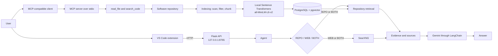

# Developer Intelligence MCP

Developer Intelligence MCP analyzes a software repository and answers developer questions using repository evidence. It combines repository inspection tools, semantic retrieval, and a Gemini-powered agent; SearXNG can provide web evidence for questions that need current or external information.

## Features

- **MCP repository tools:** read a repository-relative file and search repository files using an MCP-compatible client.
- **Repository RAG:** scan, filter, and chunk repository files; retrieve relevant code and documentation.
- **Local embeddings and vector storage:** Sentence Transformers `all-MiniLM-L6-v2` embeddings run locally on CPU and are stored with chunks in PostgreSQL using `pgvector`.
- **Agent and language model:** the agent selects repository (`REPO`), web (`WEB`), or combined (`BOTH`) sources and uses Gemini through LangChain to produce an answer.
- **Evidence tracking:** answers include repository file paths and line ranges or web result titles and URLs.
- **Web search:** SearXNG provides web results through its HTTP search API.
- **Conversation history:** follow-up context is kept in process memory.
- **Local interfaces:** a Flask `/ask` API and a minimal VS Code command that calls that API.
- **Automated tests:** tests cover repository tools, retrieval, agent behavior, and SearXNG response handling.

## Architecture



The MCP server exposes repository tools over stdio; the Flask API is a separate interface to the agent.

## Technology stack

| Area | Technologies |
| --- | --- |
| Language | Python 3.10+ |
| Repository tools | MCP Python SDK |
| Retrieval and embeddings | Sentence Transformers, `all-MiniLM-L6-v2` |
| Vector storage | PostgreSQL, `pgvector`, psycopg |
| Language model | Gemini through LangChain and `langchain-google-genai` |
| Web search | SearXNG, Docker Compose, Requests |
| HTTP API | Flask |
| Editor integration | VS Code extension (JavaScript) |
| Tests | `unittest`-based tests; runnable with pytest if installed |

## Project structure

```text
.
├── agent/                 # Agent flow and in-memory conversation history
├── rag/                   # Repository scanning, chunking, embeddings, indexing, retrieval
├── server/
│   ├── agent_api.py       # Flask /ask endpoint
│   ├── llm_config.py      # Gemini configuration
│   └── mcp_server.py      # MCP stdio server
├── tools/                 # Repository and SearXNG tools
├── tests/                 # Automated tests
├── vscode-extension/      # Minimal VS Code extension
├── searxng/               # SearXNG settings
├── docker-compose.yml     # Starts SearXNG only
├── requirements.txt
└── README.md
```

## Setup

### 1. Clone and install Python dependencies

```sh
git clone https://github.com/polinenim/developer-intelligence-MCP.git
cd developer-intelligence-MCP
python -m venv .venv
```

Activate the environment:

```sh
# macOS/Linux
source .venv/bin/activate

# Windows PowerShell
.\.venv\Scripts\Activate.ps1
```

Install the project dependencies:

```sh
python -m pip install -r requirements.txt
```

### 2. Configure the repository and database

Set the repository path to the code you want to analyze. To analyze this project, use its absolute path.

```sh
# macOS/Linux
export REPOSITORY_ROOT="/absolute/path/to/repository"
export DATABASE_URL="postgresql://localhost:5432/developer_intelligence"

# Windows PowerShell
$env:REPOSITORY_ROOT = "C:\path\to\repository"
$env:DATABASE_URL = "postgresql://localhost:5432/developer_intelligence"
```

Adjust the connection URI for the PostgreSQL host and authentication configured in your environment. Do not commit a credential-bearing URI.

Start or connect to a PostgreSQL server with the `pgvector` extension installed, then create the database:

```sh
createdb developer_intelligence
```

The vector store enables the `vector` extension and creates its table and index on the first indexing run. PostgreSQL must have the pgvector extension files installed and available to the database.

### 3. Configure Gemini securely

Supply the API key through the environment; replace the example placeholder with your own key:

```sh
# macOS/Linux
export GEMINI_API_KEY="your-gemini-api-key"

# Windows PowerShell
$env:GEMINI_API_KEY = "your-gemini-api-key"
```

Never put a real API key in source code or commit `.env` files or other secret files. The application reads `GEMINI_API_KEY` from the process environment.

### 4. Start SearXNG

Docker and Docker Compose are required for the included SearXNG service. From the project root:

```sh
docker compose up -d
```

Configure the search service URL in the same shell used to run the application:

```sh
# macOS/Linux
export SEARXNG_URL="http://localhost:8080"

# Windows PowerShell
$env:SEARXNG_URL = "http://localhost:8080"
```

The Compose file starts SearXNG only; it does not start PostgreSQL.

### 5. Index the repository

With `REPOSITORY_ROOT` and `DATABASE_URL` set, run:

```sh
python -m rag.indexing
```

This scans the selected repository, creates local embeddings, and writes the indexed chunks to PostgreSQL/pgvector.

## Running the system

### Flask API

Start the API from the project root, with the environment variables configured above:

```sh
python -m server.agent_api
```

It listens on `http://127.0.0.1:8765` and accepts `POST /ask` with a JSON `question` field.

### VS Code extension

Start the Flask API first. Open `vscode-extension/` as the extension root in VS Code, press **F5** to launch an Extension Development Host, then run **Developer Intelligence: Ask Question** from the Command Palette. The extension sends the question to the local Flask endpoint.

### MCP server

For MCP-compatible clients, configure the client to launch `python -m server.mcp_server` from the project root using the Python environment and `REPOSITORY_ROOT` configuration above. The server communicates over stdio and exposes `read_file` and `search_code`; it is separate from the Flask agent API.

## Usage examples

Ask repository questions through the API or VS Code extension:

- “How does authentication work?”
- “Which function creates the JWT token?”
- “Which files are responsible for database access?”

Ask questions that need web information:

- “What is the latest Python version?”
- “Who won IPL 2026?”

The agent chooses repository evidence, web results, or both according to the question. Web answers require a reachable SearXNG instance; repository answers require the target repository to be indexed for semantic retrieval.

## Conversation history

Conversation history is held in memory, cleared when the process restarts, and not stored in PostgreSQL.

## Testing

The test cases use `unittest` and can be run with pytest:

```sh
python -m pytest -q
```

Pytest is not listed in `requirements.txt`; install it separately if it is not already available in the environment.

## Current limitations

- The VS Code extension is minimal and connects only to the local Flask endpoint at `127.0.0.1:8765`.
- The MCP server provides only repository file-reading and text-search tools; use the Flask API for agent questions.
